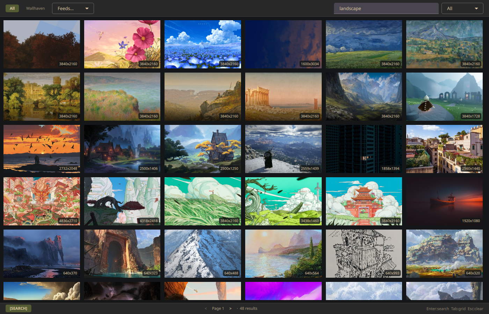

<p align="center">
  
</p>

<h1 align="center">Muralis</h1>

<p align="center">Wallpaper manager for Hyprland with multi-source search, favorites, and display modes</p>

## Status


**Beta Release** - Core functionality complete and stable. All major features implemented and tested.



## Features

- **Multi-Source Search**: Wallhaven, Unsplash, Pexels, Pixabay, imageboards (danbooru/moebooru/gelbooru), RSS/Atom feeds, and browsed sources like ultrawidewallpapers.net
- **Plugin Architecture**: Add new sources by implementing a single trait
- **Display Modes**: Static, Random, Sequential, Workspace-aware, Scheduled
- **Favorites System**: SHA-256 deduplication, SQLite metadata, persistent library
- **GUI**: Qt6/QML browser with source chips, browsed-source dropdown, category bar, thumbnail grid, preview drawer
- **Daemon**: Background service with IPC and workspace listener
- **CLI**: Full daemon control via Unix socket
- **Content-Safety Ceiling**: One global knob gates every source; nothing NSFW surfaces by default
- **Wayland-Native**: hyprpaper and swww backends with transitions

## Installation

### Prerequisites

- **Wayland compositor**: Hyprland
- **Wallpaper backend**: [swww](https://github.com/LGFae/swww) or [hyprpaper](https://github.com/hyprwm/hyprpaper)
- **SQLite**: `sqlite` (Arch) or `libsqlite3-dev` (Debian/Ubuntu)
- **Qt6**: `qt6-base qt6-declarative` (Arch)

### Build from Source

```bash
git clone https://github.com/abjoru/muralis
cd muralis

make
sudo make install DESTDIR=/
```

### Hyprland Autostart

Add to your Hyprland config:

```conf
exec-once = swww-daemon        # or hyprpaper
exec-once = muralis-daemon
```

## Usage

### Daemon

```bash
muralis-daemon

# With debug logging
RUST_LOG=debug muralis-daemon
```

The daemon spawns 3 concurrent tasks:
- IPC server (Unix socket)
- Display engine (wallpaper rotation/scheduling)
- Workspace listener (Hyprland events)

### CLI

```bash
muralis status              # Show daemon status
muralis next                # Next wallpaper
muralis prev                # Previous wallpaper
muralis set <id>            # Set specific wallpaper
muralis mode random         # Switch display mode
muralis pause               # Pause rotation
muralis resume              # Resume rotation
muralis reload              # Reload config
muralis search <query>      # Search every searched source (JSON)
muralis browse <source>     # Retrieve from a browsed source, e.g. a feed (JSON)
muralis sources list        # List sources with retrieval mode + categories (JSON)
muralis favorites list      # List all favorites (JSON)
muralis favorites stats     # Show favorites count and disk usage
muralis favorites add <url> # Keep a wallpaper from a pasted link
muralis favorites keep      # Keep a search/browse result (JSON on stdin or as an argument)
muralis cache stats         # Show cache size
muralis cache prune         # Prune cache to configured max
muralis cache clear         # Drop browsing residue, keep Library thumbnails
muralis quit                # Stop daemon
```

### GUI

```bash
muralis-gui                          # Launch wallpaper browser
muralis-gui --query "landscape"      # Launch with initial search
```

The GUI provides:
- Source chips for searched sources, a dropdown for browsed ones
- A category bar for a browsed source that publishes categories; selecting a
  category loads its first page (a feed publishes none — selecting it loads)
- Thumbnail grid with adaptive columns, cached to `~/.cache/muralis/thumbnails`
  so a thumbnail is fetched once and survives a restart (`cache stats` counts
  them separately from the Library's, `cache clear` drops them, `cache prune`
  sheds them before any Library thumbnail)
- Preview drawer with metadata and actions
- One-click favoriting (downloads full image, deduplicates by SHA-256)
- Keyboard-driven navigation (search/browse/grid/preview modes)

## Configuration

User config: `~/.config/muralis/config.toml`

### General

```toml
[general]
backend = "swww"          # "swww" or "hyprpaper"
cache_max_mb = 500        # Max cache size in MB
content_safety = "safe"   # Global ceiling: "safe" < "moderate" < "nsfw"
```

### Display

```toml
[display]
mode = "random"           # static, random, random_startup, sequential, workspace, schedule
interval = "30m"          # Rotation interval (e.g., "15m", "1h")
min_resolution = "auto"   # Minimum resolution or "auto"
aspect_ratio = "auto"     # Target aspect ratio (e.g., "16:9") or "auto"

[display.transition]      # swww only (hyprpaper ignores)
type = "fade"             # Transition type
duration = 2.0            # Duration in seconds
fps = 60
```

### Display Modes

| Mode | Description |
|------|-------------|
| `static` | Single wallpaper, no rotation |
| `random` | Random wallpaper every interval |
| `random_startup` | Random wallpaper on startup only |
| `sequential` | Cycle through wallpapers in order |
| `workspace` | Per-Hyprland-workspace wallpapers |
| `schedule` | Time-of-day based selection |

### Filter

```toml
[filter]
min_width = 2560
min_height = 1440
exclude_tags = ["anime", "cartoon"]
```

`min_width`/`min_height` are pushed to sources that support a server-side
dimension filter and applied as a client-side backstop everywhere else.

## Sources

### Content-Safety Ceiling

A single global ceiling gates **every** source. Set it in `[general]`:

```toml
[general]
content_safety = "safe"   # "safe" < "moderate" < "nsfw"  (default: "safe")
```

It is a hard cap, not a per-source toggle:

- **`safe`** (default) — every source is forced to its safest setting. Wallhaven
  purity is clamped to SFW, Pixabay safesearch is on, and each booru is pinned to
  its safest rating tag. Nothing sketchy or NSFW can surface.
- **`moderate`** — allows sketchy/sensitive content; explicit/NSFW stays excluded.
- **`nsfw`** — lifts the cap; sources may return explicit content.

A source's own config can only *tighten* within the ceiling, never loosen past it.
**Nothing NSFW-capable surfaces until you both enable a source _and_ raise the
ceiling above `safe`.** Feeds are the exception — they are user-curated URLs that
cannot be rated, so the ceiling cannot classify their images; point feeds only at
URLs whose content you trust (e.g. choose SFW subreddits to stay SFW).

### Configuring Sources

Sources are plugin-based. Each has its own `[sources.*]` config section.

#### Wallhaven

```toml
[sources.wallhaven]
enabled = true
api_key = "optional"    # Required for NSFW/sketchy purity
categories = "111"      # General/Anime/People bitmask
purity = "100"          # SFW/Sketchy/NSFW bitmask (clamped to the ceiling)
```

#### Unsplash

```toml
[sources.unsplash]
enabled = true
access_key = "your_key"     # Create an app at https://unsplash.com/developers
```

#### Pexels

```toml
[sources.pexels]
enabled = true
api_key = "your_key"        # Generate at https://www.pexels.com/api/
```

#### Pixabay

```toml
[sources.pixabay]
enabled = true
api_key = "your_key"        # Free key at https://pixabay.com/api/docs/
```

`safesearch` is driven by the ceiling: on at `safe`, off otherwise.

#### Booru (imageboards)

One `muralis-source-booru` crate serves many imageboard hosts. Add one
`[[sources.booru]]` block per host (like feeds):

- **`name`** — per-host identity, also the dedup key. Must be a known host (table below).
- **`flavor`** — the API dialect (response shape + endpoints).

| `flavor`   | Hosts (`name`)                                | Notes |
|------------|-----------------------------------------------|-------|
| `danbooru` | `danbooru`                                     | `/posts.json` flat array |
| `moebooru` | `yandere` (yande.re), `konachan`               | `/post.json`; resolve-by-id via `tags=id:N` |
| `gelbooru` | `gelbooru`, `rule34`, `safebooru`, `realbooru` | `dapi` JSON; `gelbooru` needs `api_key` + `user_id` |

```toml
[[sources.booru]]
enabled = true
name = "danbooru"
flavor = "danbooru"

[[sources.booru]]              # NSFW track — needs ceiling above "safe"
enabled = true
name = "gelbooru"
flavor = "gelbooru"
api_key = "YOUR_GELBOORU_API_KEY"
user_id = "YOUR_GELBOORU_USER_ID"
```

Gelbooru credentials are **mandatory** on gelbooru.com since 2025 (anonymous
search returns `401`). Generate them at **gelbooru.com → Account → Options →
API Access Credentials**. The clones (`rule34`/`safebooru`/`realbooru`) are
`flavor = "gelbooru"` on a different host and allow anonymous access.

> **Single-tag queries work best.** Boorus cap anonymous searches at 2 tags, and
> muralis spends one slot on the content-safety rating tag — so a one-word query
> (e.g. `landscape`) leaves room for the rating, while multi-word queries may be
> rejected.

#### Feeds (RSS/Atom)

Any RSS/Atom feed with image enclosures works — no API key. This is also how you
pull subreddits: append `.rss` to any subreddit URL.

```toml
[[sources.feeds]]
enabled = true
name = "Imaginary Landscapes"
url = "https://www.reddit.com/r/ImaginaryLandscapes/.rss"

# Ultrawide / widescreen wallpaper subreddits:
# [[sources.feeds]]
# enabled = false
# name = "Ultrawide Master Race"
# url = "https://www.reddit.com/r/ultrawidemasterrace/.rss"
```

#### Ultrawide (browsed)

[ultrawidewallpapers.net](https://ultrawidewallpapers.net/) has no API and no
text search. What it does have is a gallery endpoint taking an offset, a limit
and a tag. It is therefore a *browsed* source: no query, no search field,
reached by tag — and its categories **are** the site's tags.

```toml
[sources.ultrawide]
enabled = true
# Omit `tags` for the whole published vocabulary (28 of them):
# tags = ["Dark", "Space", "Pixel Art"]
```

```bash
muralis sources list                                            # tags it publishes
muralis browse Ultrawide --category Dark

# Tags carry spaces and punctuation, so quote them on a shell.
muralis browse Ultrawide --category 'Pixel Art'

# Keeping a browsed result: hand the result over, don't paste its source_url —
# that names the gallery, which every wallpaper listed on it shares.
muralis browse Ultrawide --category Space \
  | jq -c '.results[0]' | muralis favorites keep
```

> Every image is a **7680x2160 (32:9) master**, downloaded unaltered — muralis
> never crops or resizes. `--aspect 21x9` will correctly return nothing.

See [`assets/demo-config.toml`](assets/demo-config.toml) for a fully annotated
example covering every source plus the Reddit-as-feed recipes (ultrawide + NSFW).

### Workspace Mode

```toml
[[workspaces]]
workspace = 1
wallpaper = "nature"

[[workspaces]]
workspace = 2
wallpaper = "urban"
```

### Schedule Mode

```toml
[[schedules]]
time = "08:00"
tags = ["bright", "morning"]

[[schedules]]
time = "22:00"
tags = ["dark", "night"]
```

## Architecture

```
muralis/
├── muralis-core/              # Shared library (traits, models, config, DB, IPC)
├── muralis-source-common/     # Shared RestSource engine + HttpFetch transport seam
├── muralis-cli/               # CLI binary (clap)
├── muralis-daemon/            # Background service (IPC, display engine)
├── muralis-gui/               # Qt6/QML GUI (C++ + QML, calls CLI via QProcess)
├── muralis-source-wallhaven/  # Wallhaven API plugin
├── muralis-source-unsplash/   # Unsplash API plugin
├── muralis-source-pexels/     # Pexels API plugin
├── muralis-source-pixabay/    # Pixabay API plugin
├── muralis-source-booru/      # Multi-host imageboard plugin (danbooru/moebooru/gelbooru)
├── muralis-source-feed/       # RSS/Atom feed plugin
└── muralis-source-ultrawide/  # ultrawidewallpapers.net browsed plugin (HTML)
```

### Adding a New Source

1. Create `muralis-source-foo/` implementing `WallpaperSource` trait
2. Export `pub fn create_sources(table: &toml::Table, client: reqwest::Client, ctx: &SourceContext) -> Vec<Box<dyn WallpaperSource>>`
3. Add to workspace `Cargo.toml`
4. Add one line in `build_registry()` in `muralis-cli/src/main.rs`
5. Add `[sources.foo]` to config

`ctx: &SourceContext` (from `muralis-core::sources`) carries the global
`content_safety` ceiling and `min_width`/`min_height`. Honor it: clamp any
NSFW-capable output to the ceiling and apply the minimum dimensions.

### Data Paths

| Purpose | Path |
|---------|------|
| Config | `~/.config/muralis/config.toml` |
| Database | `~/.local/share/muralis/muralis.db` |
| Wallpapers | `~/.local/share/muralis/wallpapers/` |
| Thumbnails | `~/.cache/muralis/thumbnails/` |
| IPC socket | `/tmp/muralis-{uid}.sock` |

## Hyprland Integration

Bind CLI commands to keys in your Hyprland config:

```conf
bind = $mainMod SHIFT, N, exec, muralis next
bind = $mainMod SHIFT, P, exec, muralis prev
bind = $mainMod SHIFT, W, exec, muralis-gui
```

## Development

```bash
make                                 # Build Rust crates + QML GUI
cargo test                           # Run all tests
cargo clippy --workspace             # Lint
cargo fmt --all -- --check           # Check formatting
cargo run -p muralis-cli -- status   # Run CLI
cargo run -p muralis-daemon          # Run daemon
./muralis-gui/build/muralis-gui      # Run GUI
```

## License

MIT License - see [LICENSE](LICENSE) for details

Copyright (c) 2026 Andreas Bjoru
